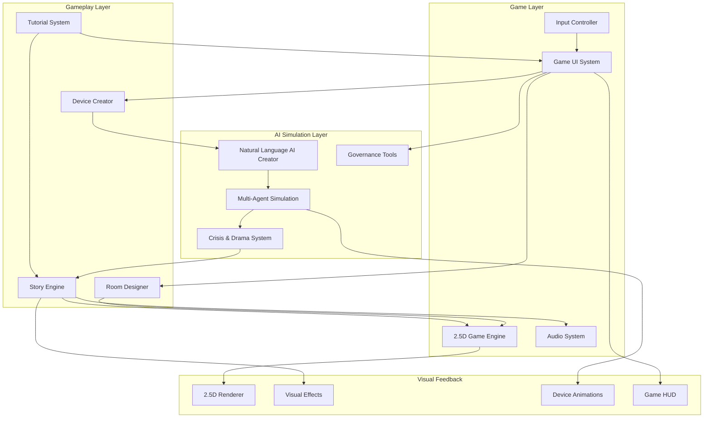

# Design Document

## Overview

AI Habitat is a 2.5D isometric game where players create and manage smart environments filled with AI devices that come to life with personalities, goals, and quirks. The game combines intuitive drag-and-drop gameplay with deep emergent storytelling as players watch their AI creations interact, cooperate, conflict, and sometimes spectacularly malfunction.

The system consists of six core components: the Game Engine for 2.5D rendering and user interaction, the Natural Language Processing Engine for device creation, the Multi-Agent Simulation Framework for AI behavior, the Interaction Management System for device communication, the Crisis Detection System for dramatic failure scenarios, and the Game UI System for intuitive player controls and feedback.

The architecture prioritizes engaging gameplay and visual storytelling while maintaining educational depth. Players experience AI concepts through immediate visual feedback, character-like device personalities, and dramatic story moments rather than abstract technical concepts.

## Architecture

### Game Architecture Diagram



### Core Game Components

1. **2.5D Game Engine**: Isometric rendering, smooth animations, and intuitive drag-and-drop interactions
2. **Game UI System**: User-friendly interfaces for device creation, room design, and crisis management
3. **Natural Language AI Creator**: Transforms player descriptions into quirky AI device personalities
4. **Multi-Agent Simulation**: Manages AI device behaviors, interactions, and emergent storytelling
5. **Crisis & Drama System**: Creates spectacular failure scenarios with visual flair and recovery gameplay
6. **Story Engine**: Generates narrative moments and connects gameplay to educational insights

## Game Visual Design

### 2.5D Isometric Art Style

**Visual Theme**: Clean, modern smart home aesthetic with personality-rich device characters
- **Environments**: Detailed isometric rooms with realistic furniture and smart device placements
- **Device Characters**: Each AI device has a distinct visual personality with animated expressions and status indicators
- **Interaction Visualization**: Glowing connection lines, particle effects for communication, and visual conflict indicators
- **Crisis Effects**: Dramatic visual feedback for system failures including screen shake, warning overlays, and emergency lighting

**Color Psychology for Game States**:
- **Harmony (Green)**: Soft green glows, smooth animations, peaceful ambient lighting
- **Tension (Yellow)**: Amber warning indicators, slightly faster animations, cautionary UI elements
- **Chaos (Orange)**: Pulsing orange alerts, erratic device movements, increasing visual noise
- **Crisis (Red)**: Flashing red warnings, screen effects, dramatic failure animations

### User Interface Design Philosophy

**Intuitive Drag-and-Drop Gameplay**:
- Visual device library with clear categories and preview animations
- Snap-to-grid placement with visual feedback for valid/invalid positions
- One-click device selection with contextual property panels
- Natural language input with auto-complete and suggestion bubbles

**Real-Time Feedback Systems**:
- Device mood indicators (happy, confused, angry, cooperative)
- Live connection visualization showing device communication
- Resource usage bars with color-coded efficiency ratings
- System health dashboard with clear visual hierarchy

## Components and Interfaces

### 2.5D Game Engine

**Purpose**: Provide smooth, engaging 2.5D isometric gameplay with intuitive controls and visual storytelling.

**Key Classes**:
- `GameRenderer`: Manages 2.5D isometric rendering with smooth animations and visual effects
- `InputManager`: Handles mouse/touch input for drag-and-drop device placement and UI interactions
- `AnimationSystem`: Controls device animations, connection effects, and crisis visual feedback
- `CameraController`: Manages camera movement, zoom, and focus for optimal gameplay experience

**Interfaces**:
```typescript
interface GameRenderer {
  renderScene(scene: GameScene): void;
  animateDevice(device: DeviceVisual, animation: AnimationType): void;
  showConnectionEffect(from: DeviceVisual, to: DeviceVisual, effectType: EffectType): void;
  displayCrisisEffect(crisis: CrisisVisual): void;
}

interface InputManager {
  handleDeviceDrag(device: DeviceVisual, position: Vector2): DragResult;
  handleRoomInteraction(position: Vector2): InteractionResult;
  handleUIClick(element: UIElement): ClickResult;
  enableTutorialMode(constraints: TutorialConstraints): void;
}
```

### Game UI System

**Purpose**: Provide intuitive, user-friendly interfaces that make complex AI concepts accessible through visual design.

**Key Classes**:
- `DeviceCreationPanel`: Natural language input with visual feedback and device preview
- `RoomDesigner`: Drag-and-drop interface for environment creation and device placement
- `CrisisManagementHUD`: Emergency controls with clear visual hierarchy and guided recovery
- `TutorialOverlay`: Contextual help system with interactive highlights and step-by-step guidance

**Interfaces**:
```typescript
interface DeviceCreationPanel {
  showNaturalLanguageInput(): void;
  displayDevicePreview(specification: DeviceSpec): DevicePreview;
  provideSuggestions(partialInput: string): Suggestion[];
  validateDeviceDescription(description: string): ValidationResult;
}

interface RoomDesigner {
  displayDeviceLibrary(): DeviceLibrary;
  enableDevicePlacement(device: DeviceType): PlacementMode;
  showPlacementFeedback(position: Vector2, device: DeviceType): PlacementFeedback;
  highlightCompatibleDevices(selectedDevice: DeviceVisual): CompatibilityHighlight[];
}
```

### Natural Language Processing Engine

**Purpose**: Convert player device descriptions into executable AI behavior models with realistic limitations and misinterpretations.

**Key Classes**:
- `DeviceSpecificationParser`: Extracts intent, constraints, and objectives from natural language
- `BehaviorModelGenerator`: Creates AI personality profiles with learning algorithms and communication styles
- `IntentionMisalignmentSimulator`: Introduces realistic gaps between player intent and AI implementation
- `PersonalityVariationEngine`: Generates different AI personalities from identical descriptions

**Interfaces**:
```typescript
interface DeviceSpecification {
  description: string;
  environment: EnvironmentType;
  category: DeviceCategory;
}

interface AIBehaviorModel {
  primaryObjective: string;
  learningAlgorithm: LearningType;
  communicationStyle: CommunicationStyle;
  conflictResolution: ConflictStyle;
  hiddenAssumptions: string[];
  uncertaintyFactors: number[];
}
```

### Multi-Agent Simulation Framework

**Purpose**: Simulate autonomous AI agents with realistic decision-making, learning, and adaptation capabilities.

**Key Classes**:
- `AIAgent`: Individual device simulation with behavior model execution
- `SimulationEngine`: Manages agent lifecycle, time progression, and state updates
- `LearningSystem`: Implements agent adaptation based on environmental feedback
- `DecisionMaker`: Processes agent objectives and constraints to generate actions

**Interfaces**:
```typescript
interface AIAgent {
  id: string;
  behaviorModel: AIBehaviorModel;
  currentState: AgentState;
  executeDecisionCycle(): AgentAction[];
  learn(feedback: EnvironmentFeedback): void;
  communicate(message: AgentMessage): AgentResponse;
}

interface SimulationEngine {
  agents: AIAgent[];
  environment: Environment;
  step(): void;
  addAgent(agent: AIAgent): void;
  removeAgent(agentId: string): void;
}
```

### Interaction Management System

**Purpose**: Coordinate agent-to-agent communication, resource allocation, and conflict detection.

**Key Classes**:
- `CommunicationHub`: Routes messages between compatible agents
- `ResourceManager`: Tracks and allocates shared resources (energy, bandwidth, processing)
- `ConflictDetector`: Identifies when agent objectives create incompatible demands
- `CooperationFacilitator`: Enables synergistic agent combinations

**Interfaces**:
```typescript
interface InteractionManager {
  facilitateCommunication(sender: AIAgent, receiver: AIAgent, message: AgentMessage): boolean;
  allocateResources(requests: ResourceRequest[]): ResourceAllocation[];
  detectConflicts(agents: AIAgent[]): ConflictReport[];
  enableCooperation(agents: AIAgent[]): CooperationOpportunity[];
}

interface ConflictReport {
  conflictType: ConflictType;
  involvedAgents: string[];
  severity: number;
  escalationPotential: number;
  suggestedResolutions: ResolutionStrategy[];
}
```

### Crisis Detection and Recovery System

**Purpose**: Monitor system health, detect failure patterns, and provide intervention tools for crash scenarios.

**Key Classes**:
- `SystemHealthMonitor`: Tracks harmony indicators and performance metrics
- `CrashScenarioDetector`: Identifies feedback loops, authority conflicts, and optimization spirals
- `EmergencyInterventionSystem`: Provides circuit breakers, priority overrides, and manual controls
- `RecoveryOrchestrator`: Guides players through diagnostic and recovery processes

**Interfaces**:
```typescript
interface CrisisDetector {
  monitorSystemHealth(): HealthStatus;
  detectCrashScenarios(): CrashScenario[];
  assessEscalationRisk(conflict: ConflictReport): RiskLevel;
  triggerEmergencyProtocols(scenario: CrashScenario): InterventionOptions[];
}

interface RecoverySystem {
  diagnoseFailure(crashData: CrashScenario): DiagnosticReport;
  provideInterventionTools(): InterventionTool[];
  implementRecoveryStrategy(strategy: RecoveryStrategy): RecoveryResult;
  preventFutureFailures(lessons: LessonLearned[]): GovernanceRule[];
}
```

### Governance Controller

**Purpose**: Implement and enforce player-defined rules, priorities, and constraints across the system.

**Key Classes**:
- `RuleEngine`: Processes and enforces governance rules in real-time
- `PriorityManager`: Manages hierarchical decision-making during conflicts
- `PolicyEnforcer`: Ensures compliance with ethical guidelines and resource constraints
- `ConstitutionalFramework`: Maintains unchangeable core principles

**Interfaces**:
```typescript
interface GovernanceController {
  enforceRules(action: AgentAction, rules: GovernanceRule[]): EnforcementResult;
  resolvePriorityConflicts(conflicts: ConflictReport[], priorities: Priority[]): Resolution[];
  updatePolicies(newPolicies: Policy[]): PolicyUpdateResult;
  validateConstitutionalCompliance(action: AgentAction): ComplianceResult;
}
```

### Audio System

**Purpose**: Provide immersive audio feedback that enhances gameplay and reinforces learning through sound design.

**Key Classes**:
- `AudioManager`: Manages all game audio including device sounds, music, and UI feedback
- `DeviceSoundEngine`: Generates personality-based sounds for AI devices
- `DynamicMusicSystem`: Adjusts background music based on system harmony levels
- `AccessibilityAudioSystem`: Provides audio descriptions and sound-based navigation aids

**Interfaces**:
```typescript
interface AudioManager {
  playDeviceSound(device: DeviceVisual, soundType: DeviceSoundType): void;
  updateAmbientMusic(harmonyLevel: HarmonyLevel): void;
  playUIFeedback(action: UIAction): void;
  enableAccessibilityMode(options: AccessibilityOptions): void;
}

interface DeviceSoundEngine {
  generatePersonalitySound(personality: PersonalityTrait, emotion: EmotionState): SoundEffect;
  playInteractionSound(interaction: InteractionType): void;
  createCooperationChime(devices: DeviceVisual[]): HarmonySound;
  generateConflictSound(conflict: ConflictReport): DissonanceSound;
}
```

### Tutorial and Scenario System

**Purpose**: Guide players through learning experiences with progressive difficulty and contextual education.

**Key Classes**:
- `TutorialManager`: Orchestrates interactive tutorials with guided disasters and learning moments
- `ScenarioEngine`: Manages scenario selection, progression, and difficulty adaptation
- `AchievementSystem`: Tracks learning milestones and rewards creative problem-solving
- `ProgressTracker`: Monitors player skill development and provides personalized recommendations

**Interfaces**:
```typescript
interface TutorialManager {
  startTutorial(tutorialId: string): TutorialSession;
  provideContextualHint(gameState: GameState): Hint;
  checkCompletionCriteria(session: TutorialSession): CompletionStatus;
  unlockNextScenario(completedTutorial: string): UnlockResult;
}

interface ScenarioEngine {
  loadScenario(scenarioId: string): ScenarioInstance;
  adaptDifficulty(playerPerformance: PerformanceData): DifficultyAdjustment;
  validateObjectives(scenario: ScenarioInstance): ObjectiveStatus[];
  generateCustomScenario(parameters: ScenarioParameters): CustomScenario;
}

interface AchievementSystem {
  checkAchievements(gameEvent: GameEvent): Achievement[];
  unlockAchievement(achievementId: string): UnlockNotification;
  trackProgress(skillCategory: SkillCategory, improvement: number): ProgressUpdate;
  generateLeaderboard(category: LeaderboardCategory): LeaderboardData;
}
```

### Save/Load and Sharing System

**Purpose**: Enable players to save progress, experiment freely, and share successful strategies with others.

**Key Classes**:
- `SaveManager`: Handles comprehensive save/load functionality for all game state
- `ConfigurationSharing`: Manages sharing and importing of device configurations and governance strategies
- `CloudSync`: Synchronizes player progress and shared content across devices
- `CollaborationTools`: Enables collaborative scenario creation and community features

**Interfaces**:
```typescript
interface SaveManager {
  saveGameState(state: GameState): SaveResult;
  loadGameState(saveId: string): GameState;
  createQuickSave(label: string): QuickSaveResult;
  exportConfiguration(config: Configuration): ExportData;
  importConfiguration(data: ExportData): ImportResult;
}

interface ConfigurationSharing {
  shareConfiguration(config: Configuration): ShareResult;
  browseSharedConfigurations(filters: BrowseFilters): SharedConfiguration[];
  rateConfiguration(configId: string, rating: Rating): RatingResult;
  downloadConfiguration(configId: string): DownloadResult;
}
```

## Data Models

### Core Entity Models

```typescript
// Environment and Device Models
interface Environment {
  id: string;
  type: EnvironmentType; // Home, Hospital, Office
  spaces: Space[];
  globalRules: GovernanceRule[];
  resourceLimits: ResourceLimit[];
}

interface Space {
  id: string;
  name: string;
  devices: AIAgent[];
  environmentalFactors: EnvironmentFactor[];
}

// Agent Behavior Models
interface AgentState {
  currentObjectives: Objective[];
  resourceUsage: ResourceUsage;
  learningHistory: LearningEvent[];
  communicationLog: CommunicationEvent[];
  performanceMetrics: PerformanceMetric[];
}

interface LearningEvent {
  timestamp: number;
  trigger: string;
  behaviorChange: BehaviorChange;
  confidence: number;
}

// Interaction and Conflict Models
interface AgentMessage {
  senderId: string;
  receiverId: string;
  messageType: MessageType;
  content: any;
  priority: number;
  timestamp: number;
}

interface ConflictType {
  RESOURCE_COMPETITION = "resource_competition";
  OBJECTIVE_CONTRADICTION = "objective_contradiction";
  AUTHORITY_DISPUTE = "authority_dispute";
  COMMUNICATION_BREAKDOWN = "communication_breakdown";
  OPTIMIZATION_SPIRAL = "optimization_spiral";
}

// Crisis and Recovery Models
interface CrashScenario {
  id: string;
  type: CrashType;
  severity: number;
  involvedAgents: string[];
  triggerEvents: Event[];
  cascadeEffects: CascadeEffect[];
  recoveryOptions: RecoveryOption[];
}

interface DiagnosticReport {
  rootCauses: RootCause[];
  contributingFactors: Factor[];
  systemImpact: ImpactAssessment;
  recommendedActions: RecommendedAction[];
}
```

### Governance and Rule Models

```typescript
interface GovernanceRule {
  id: string;
  name: string;
  priority: number;
  condition: RuleCondition;
  action: RuleAction;
  scope: RuleScope;
  constitutional: boolean;
}

interface Priority {
  category: string; // Safety, Comfort, Efficiency, Privacy
  weight: number;
  contextualModifiers: ContextModifier[];
}

interface ResourceLimit {
  resourceType: ResourceType;
  maxAllocation: number;
  allocationStrategy: AllocationStrategy;
  overrideConditions: OverrideCondition[];
}
```

### Game-Specific Models

```typescript
// Visual and UI Models
interface DeviceVisual {
  id: string;
  model3D: Model3D;
  position: Vector3;
  animations: AnimationSet;
  personalityIndicators: PersonalityVisual[];
  connectionEffects: VisualEffect[];
}

interface GameScene {
  environment: Environment3D;
  devices: DeviceVisual[];
  camera: CameraState;
  lighting: LightingSetup;
  effects: VisualEffect[];
}

interface PersonalityVisual {
  trait: PersonalityTrait;
  expression: FacialExpression;
  colorScheme: ColorPalette;
  animationStyle: AnimationStyle;
}

// Tutorial and Scenario Models
interface Tutorial {
  id: string;
  steps: TutorialStep[];
  objectives: LearningObjective[];
  completionCriteria: CompletionCriteria[];
}

interface Scenario {
  id: string;
  name: string;
  description: string;
  difficulty: DifficultyLevel;
  environment: EnvironmentTemplate;
  presetDevices: DeviceConfiguration[];
  objectives: ScenarioObjective[];
  successCriteria: SuccessCriteria[];
}

interface Achievement {
  id: string;
  name: string;
  description: string;
  category: AchievementCategory;
  unlockConditions: UnlockCondition[];
  rewards: Reward[];
}

// Audio and Effects Models
interface AudioSystem {
  deviceSounds: SoundEffect[];
  ambientMusic: MusicTrack[];
  uiFeedback: UISound[];
  dynamicMixer: AudioMixer;
}

interface VisualEffect {
  type: EffectType;
  duration: number;
  intensity: number;
  particles: ParticleSystem;
  shaders: ShaderEffect[];
}
```

### Save/Load and Sharing Models

```typescript
interface SaveData {
  version: string;
  timestamp: number;
  playerProgress: PlayerProgress;
  environments: SavedEnvironment[];
  customDevices: CustomDevice[];
  governanceRules: SavedGovernanceRule[];
}

interface SharedConfiguration {
  id: string;
  creatorId: string;
  name: string;
  description: string;
  type: ConfigurationType; // Device, Room, Governance, Scenario
  data: ConfigurationData;
  ratings: UserRating[];
  downloadCount: number;
}

interface PlayerProgress {
  completedTutorials: string[];
  unlockedScenarios: string[];
  achievements: Achievement[];
  skillLevels: SkillLevel[];
  learningAnalytics: LearningData[];
}
```

## Error Handling

### Simulation Error Recovery

**Agent Failure Handling**:
- Graceful degradation when agents encounter unexpected states
- Automatic rollback to last stable configuration for critical failures
- Isolation protocols to prevent single agent failures from cascading
- Recovery procedures that maintain simulation continuity

**Communication Error Management**:
- Message queue persistence during temporary communication failures
- Timeout handling for unresponsive agents
- Conflict resolution when multiple agents claim the same resources
- Fallback communication protocols when primary channels fail

### User Experience Error Handling

**Input Validation and Feedback**:
- Natural language processing error recovery with clarification requests
- Graceful handling of ambiguous or impossible device specifications
- Real-time validation of governance rules with conflict warnings
- Undo/redo functionality for configuration changes

**System State Recovery**:
- Checkpoint system for saving stable simulation states
- Emergency reset capabilities that preserve learning progress
- Diagnostic mode for troubleshooting complex system failures
- Export/import functionality for sharing successful configurations

## Testing Strategy

### Multi-Agent Simulation Testing

**Unit Testing**:
- Individual agent behavior verification against specification models
- Communication protocol testing with mock agent interactions
- Resource allocation algorithm validation with edge case scenarios
- Governance rule enforcement testing with conflicting priorities

**Integration Testing**:
- End-to-end scenario testing with known cooperation and conflict patterns
- Performance testing with varying numbers of agents and complexity levels
- Stress testing with intentionally conflicting objectives and resource constraints
- Recovery system testing with simulated crash scenarios

### Educational Effectiveness Testing

**Learning Outcome Validation**:
- Pre/post assessment integration with simulation scenarios
- Analytics validation for measuring player understanding progression
- Reflection prompt effectiveness testing with target educational audiences
- Real-world concept transfer validation through case study comparisons

**User Experience Testing**:
- Usability testing for natural language device creation interface
- Visualization effectiveness testing for system health and interaction displays
- Crisis management tool usability during high-stress failure scenarios
- Accessibility testing for diverse learning styles and technical backgrounds

### Emergent Behavior Testing

**Scenario Validation**:
- Verification that known cooperation patterns emerge from appropriate configurations
- Confirmation that conflict scenarios produce expected failure modes
- Testing that governance rules effectively prevent or mitigate known crash types
- Validation that learning systems produce realistic adaptation patterns

**Unpredictability Assurance**:
- Testing that identical configurations can produce different outcomes
- Verification that small changes can produce dramatically different results
- Confirmation that the system generates genuinely surprising emergent behaviors
- Testing that player interventions have realistic and proportional effects
### 
Game-Specific Testing

**Visual and Audio Testing**:
- 2.5D rendering performance testing across different device capabilities
- Animation synchronization testing with AI behavior changes
- Audio-visual synchronization testing for device personality expressions
- Accessibility testing for colorblind users and hearing-impaired players

**Tutorial and Progression Testing**:
- Tutorial effectiveness testing with target age groups and skill levels
- Scenario difficulty curve validation through player testing
- Achievement trigger accuracy testing across different play styles
- Learning outcome measurement validation through pre/post assessments

**Save/Load and Sharing Testing**:
- Save data integrity testing across game updates and platform changes
- Configuration sharing functionality testing with various content types
- Cross-platform compatibility testing for shared configurations
- Performance testing for large numbers of shared configurations

**User Experience Testing**:
- Drag-and-drop interface responsiveness testing across input methods
- Natural language processing accuracy testing with diverse player inputs
- Crisis management tool usability testing during high-stress scenarios
- Onboarding experience testing with players of varying technical backgrounds